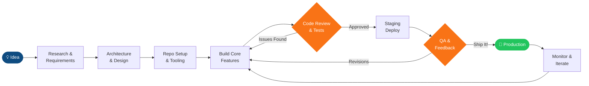

<!--
  ╔══════════════════════════════════════════════════════════════════════╗
  ║            SUMAN SAHA — GITHUB PROFILE README                        ║
  ║  Full Stack MERN Developer | Blockchain Enthusiast | AI/ML Learner   ║
  ║  Last updated: 2025 | Maintained actively                            ║
  ╚══════════════════════════════════════════════════════════════════════╝
-->

<!-- ╔═══════════════════════════════════════╗ -->
<!-- ║           HEADER BANNER               ║ -->
<!-- ╚═══════════════════════════════════════╝ -->


<!-- STATUS & META BADGES -->
<p align="center">
  
  &nbsp;
  <a href="https://github.com/Suman-byte8?tab=followers">
    
  </a>
  &nbsp;
  
  &nbsp;
  
  &nbsp;
  
</p>

<!-- SOCIAL PROFILE BADGES -->
<p align="center">
  <a href="https://www.linkedin.com/in/suman-saha-130ab0267/" target="_blank" rel="noopener noreferrer">
    
  </a>
  &nbsp;
  <a href="mailto:sumansahaweb.dev@gmail.com">
    
  </a>
  &nbsp;
  <a href="https://sumancodes.netlify.app/home#" target="_blank" rel="noopener noreferrer">
    
  </a>
</p>

<br/>

<!-- ANIMATED TYPING BANNER -->
<p align="center">
  
</p>

---

## 📋 Table of Contents

| # | Section | What's Inside |
|---|---------|---------------|
| 01 | [🧠 About Me](#-about-me) | Background, values & developer identity |
| 02 | [🔧 Tech Arsenal](#-tech-arsenal) | Full breakdown of my stack by domain |
| 03 | [✨ Featured Projects](#-featured-projects) | 4 highlighted builds with architecture notes |
| 04 | [🚀 Quick Start](#-quick-start) | Clone & run any of my projects in under 5 min |
| 05 | [🏗️ Development Workflow](#️-development-workflow) | How I architect, build, and ship software |
| 06 | [📊 GitHub Analytics](#-github-analytics) | Stats, streak, language breakdown & activity |
| 07 | [🗺️ Roadmap & Currently Building](#%EF%B8%8F-roadmap--currently-building) | Active projects + 2025 learning plan |
| 08 | [🌊 Contribution Activity](#-contribution-activity) | Snake animation of my GitHub contributions |
| 09 | [🤝 Collaboration Guide](#-collaboration-guide) | PR process, commit standards, issue labels |
| 10 | [📬 Let's Connect](#-lets-connect) | Reach out — DMs are open |

---

## 🧠 About Me


Hey, I'm **Suman** — a full-stack developer from **West Bengal, India** who builds things for the web, the blockchain, and eventually the machines 🤖.

My core is the **MERN stack**, but I enjoy exploring across the whole product surface — from database schema design to crafting interfaces that feel fast and sharp. Currently expanding into **Blockchain / Web3** with Solidity & Hardhat, and working through the fundamentals of **Machine Learning and Data Science** end-to-end.

**What drives me:**
- 🏗️ Building products that actually get used — not just demos
- 🧹 Writing code that future-me won't need to rewrite from scratch
- 📖 Learning in public and sharing what I discover along the way
- 🎨 Making UIs that look deceptively simple but work beautifully

<br clear="right"/>

```js
const suman = {
  role     : "MERN Stack Developer",
  location : "West Bengal, India 🇮🇳",

  coreStack : [
    "MongoDB", "PostgreSQL",
    "Express.js", "React",
    "Node.js", "TypeScript",
  ],

  currentlyBuilding : [
    "NFT-integrated ride booking platform ⛓️",
    "End-to-end ML workflows for real-world use cases 🤖",
    "Data analysis pipelines with Python, NumPy & Pandas 📊",
  ],

  learning : [
    "Data Analytics", "Machine Learning",
    "Smart Contract best practices (Hardhat)",
    "Scikit-Learn & model evaluation",
  ],

  openTo : [
    "Freelance projects",
    "Open source collaboration",
    "Blockchain / Web3 DApps",
    "Beginner-friendly AI / Data Science projects",
  ],

  funFact  : "I debug best with lo-fi music and a cold cup of tea ☕",
  contact  : "sumansahaweb.dev@gmail.com",
};
```

<br/>

<table align="center">
  <thead>
    <tr>
      <th>⚡ Primary Stack</th>
      <th>⛓️ Blockchain</th>
      <th>🎨 Design</th>
      <th>🤖 AI / ML</th>
      <th>🌐 Projects Shipped</th>
    </tr>
  </thead>
  <tbody>
    <tr>
      <td align="center">MERN + TypeScript</td>
      <td align="center">Solidity / Hardhat</td>
      <td align="center">Figma + Blender</td>
      <td align="center">Actively Learning 🔄</td>
      <td align="center">4 Live ✅</td>
    </tr>
  </tbody>
</table>

---

## 🔧 Tech Arsenal

> My complete toolkit, organized by domain.

### 🎨 Frontend

<p>
  
</p>

### ⚙️ Backend & Databases

<p>
  
</p>

### ⛓️ Blockchain & Web3

<p>
  
  &nbsp;
  
  &nbsp;
  
  &nbsp;
  
  &nbsp;
  
</p>

### 🤖 AI / Data Science *(Actively Learning)*

<p>
  
  &nbsp;
  
  &nbsp;
  
  &nbsp;
  
  &nbsp;
  
</p>

### 🛠️ DevTools & Creative

<p>
  
</p>

---

## ✨ Featured Projects

> A selection of my most meaningful builds — each solving a real problem.

---

### 🎓 EduQuest — Full MERN E-Learning Platform

<details>
<summary><b>📂 View architecture, features & details</b></summary>

<br/>

**EduQuest** is a production-grade e-learning platform on the MERN stack enabling course creation, enrollment, real-time progress tracking, and tiered role management.

**Core Features**

| Feature | Description |
|---------|-------------|
| 🔐 Auth & Roles | JWT-based authentication with Student / Instructor / Admin tiers |
| 📹 Content Delivery | Structured course modules with progress tracking per user |
| 💳 Payments | Gateway integration for course purchase flows |
| 📱 Responsive UI | Tailwind-based layout optimized across all viewport sizes |
| 🔍 Search & Filter | Course discovery with category and skill-level filters |

**Monorepo Architecture**

```
eduquest/
├── client/                    # React SPA (Vite + TypeScript)
│   ├── src/
│   │   ├── components/        # Reusable UI components
│   │   ├── pages/             # Route-level page components
│   │   ├── hooks/             # Custom React hooks
│   │   ├── store/             # Global state (Context / Redux)
│   │   └── utils/             # Helpers, formatters, validators
│   └── vite.config.ts
│
├── server/                    # Express.js REST API
│   ├── routes/                # API route definitions
│   ├── controllers/           # Business logic handlers
│   ├── models/                # Mongoose schemas (User, Course, Enrollment)
│   ├── middleware/            # Auth, error handling, rate limiting
│   └── config/                # DB connection, env config
│
└── README.md
```

**Tech Stack:** `MongoDB` · `Express.js` · `React` · `Node.js` · `JWT` · `Tailwind CSS`

[](https://github.com/Suman-byte8)

</details>

---

### 🖼️ FrameCraft — Custom Shopify Storefront

<details>
<summary><b>📂 View architecture, features & details</b></summary>

<br/>

A fully custom **Shopify theme** built with Liquid templating and Tailwind CSS for a premium art frames product line. Prioritizes performance, conversion, and a premium feel.

**Core Features**

| Feature | Description |
|---------|-------------|
| 🎨 Custom Liquid Sections | Built-from-scratch theme sections and blocks — no Debut/Dawn base |
| ⚡ Optimized Images | Responsive `srcset` delivery with native lazy loading |
| 📐 Product Configurator | Custom UI for frame size & material selection |
| 🛒 Enhanced Cart UX | Live cart updates, quantity controls, persistent cart state |
| 📊 Analytics Hooks | Storefront event tracking via Shopify Analytics |

**Theme Architecture**

```
framecraft-theme/
├── assets/               # CSS, JS bundles, fonts, SVGs
├── config/               # Theme settings schema
├── layout/               # theme.liquid (root shell)
├── sections/             # Reusable page sections
│   ├── hero-banner.liquid
│   ├── product-grid.liquid
│   └── product-configurator.liquid
├── snippets/             # Reusable partials
├── templates/            # Page, product, collection templates
└── locales/              # i18n translation strings
```

**Tech Stack:** `Shopify Liquid` · `Tailwind CSS` · `Vanilla JavaScript`

[](https://github.com/Suman-byte8)

</details>

---

### ⛓️ NFT Warranty System — Blockchain-Backed eCommerce

<details>
<summary><b>📂 View architecture, features & details</b></summary>

<br/>

A decentralized warranty management system where warranties are minted as **NFTs on-chain** — verifiable, transferable, and tamper-proof without any trusted third party.

**Core Features**

| Feature | Description |
|---------|-------------|
| 🔐 On-Chain Warranties | Warranties minted as ERC-721 NFTs on purchase |
| 🌐 IPFS Metadata | Product & warranty metadata stored immutably on IPFS |
| 🦊 Web3 Auth | MetaMask-based wallet authentication — no passwords |
| 🔄 NFT Transfers | Warranty follows the product when ownership transfers |
| ✅ Claim Verification | On-chain claim status — no central authority needed |

**System Data Flow**

```
┌───────────────────────────────────────────────────────────────────┐
│  PURCHASE FLOW                                                    │
│  Customer Buys Product  →  Smart Contract Mints NFT Warranty      │
│                         →  Metadata stored on IPFS               │
│                         →  NFT sent to buyer's wallet            │
├───────────────────────────────────────────────────────────────────┤
│  TRANSFER FLOW                                                    │
│  Owner Transfers Product  →  NFT Transferred to New Wallet        │
│                           →  New owner inherits warranty rights  │
├───────────────────────────────────────────────────────────────────┤
│  CLAIM FLOW                                                       │
│  Owner Initiates Claim  →  Contract verifies NFT ownership        │
│                         →  Claim event emitted on-chain          │
│                         →  Resolution process begins             │
└───────────────────────────────────────────────────────────────────┘
```

**Tech Stack:** `Solidity` · `Hardhat` · `IPFS` · `Web3.js` · `React` · `Node.js`

[](https://github.com/Suman-byte8)

</details>

---

### 🖼️ Bulk Image Converter — 100% Client-Side

<details>
<summary><b>📂 View architecture, features & details</b></summary>

<br/>

A zero-dependency, zero-backend image format converter built in **pure Vanilla JS**. All processing happens in the browser — no files ever leave the user's machine.

**Core Features**

| Feature | Description |
|---------|-------------|
| 🔒 Privacy First | 100% client-side — no uploads, no server, no tracking |
| 🖼️ HEIC Support | HEIC/HEIF → JPEG/PNG via WebAssembly decoder |
| 📦 Bulk Convert | Process entire batches and download as a single ZIP |
| 👁️ Live Preview | Instant preview of converted output before download |
| ⚡ No Install | Runs directly in the browser — nothing to install |

**Browser Processing Pipeline**

```
File Input (drag & drop / picker)
        │
        ▼
Format Detection (MIME type + magic bytes)
        │
        ├── HEIC/HEIF  →  WASM Decoder  →  Canvas Render
        ├── PNG/JPG    →  FileReader API  →  Canvas Render
        └── Other      →  Format Error feedback
                │
                ▼
        Canvas → Blob (target format)
                │
                ▼
        JSZip → ZIP Archive → Download trigger
```

**Tech Stack:** `Vanilla JavaScript` · `WebAssembly` · `Canvas API` · `Python (CLI version)`

[](https://github.com/Suman-byte8)

</details>

---

## 🚀 Quick Start

> Get any of my projects running locally in under 5 minutes.

<details open>
<summary><b>⚙️ MERN Stack Projects</b></summary>

```bash
# 1. Clone the repo
git clone https://github.com/Suman-byte8/<repo-name>.git
cd <repo-name>

# 2. Install all dependencies (root + client + server)
npm install
cd client && npm install && cd ..
cd server && npm install && cd ..

# 3. Configure environment variables
cp server/.env.example server/.env
# → Fill in: MONGO_URI, JWT_SECRET, PORT

# 4. Run development servers (concurrently)
npm run dev
# Client:  http://localhost:5173
# Server:  http://localhost:5000
```

</details>

<details>
<summary><b>⛓️ Solidity / Hardhat Projects</b></summary>

```bash
# 1. Clone and install
git clone https://github.com/Suman-byte8/<repo-name>.git
cd <repo-name>
npm install

# 2. Start a local Hardhat node
npx hardhat node

# 3. Deploy contracts to the local network
npx hardhat run scripts/deploy.js --network localhost

# 4. Run the test suite
npx hardhat test
# Expected: All tests passing ✓

# 5. Connect MetaMask to localhost:8545 (Chain ID: 31337)
```

</details>

<details>
<summary><b>🐍 Python / Data Science Projects</b></summary>

```bash
# 1. Clone and enter directory
git clone https://github.com/Suman-byte8/<repo-name>.git
cd <repo-name>

# 2. Create and activate a virtual environment
python -m venv venv
source venv/bin/activate        # macOS / Linux
# or: venv\Scripts\activate     # Windows

# 3. Install dependencies
pip install -r requirements.txt

# 4. Launch Jupyter Notebook (if applicable)
jupyter notebook

# 5. Or run the script directly
python main.py
```

</details>

<details>
<summary><b>🐳 Docker (where available)</b></summary>

```bash
# Clone and build
git clone https://github.com/Suman-byte8/<repo-name>.git
cd <repo-name>

# Build and start all services
docker-compose up --build

# Stop containers
docker-compose down
```

</details>

---

## 🏗️ Development Workflow

> How I go from idea to shipped product — consistently.



**My Engineering Principles**

```
📐  Architecture First  →  Think before you type. Draw the system first.
🧪  Test As You Go      →  Catch bugs in development, not production.
📝  Document Always     →  Your future self and contributors will thank you.
🔄  Ship Small, Often   →  Frequent focused PRs beat massive rewrites.
♻️  DRY + SOLID         →  Write code once, compose it everywhere.
🔍  Read the Errors     →  Stack traces tell you exactly what to fix.
```

---

## 📊 GitHub Analytics

<!-- Row 1: Main Stats + Streak -->
<p align="center">
  
  &nbsp;&nbsp;
  
</p>

<!-- Row 2: Top Languages -->
<p align="center">
  
</p>

<!-- Row 3: GitHub Trophies -->
<p align="center">
  
</p>

<!-- Row 4: Activity Graph -->
<p align="center">
  
</p>

---

## 🗺️ Roadmap & Currently Building

### 🔥 Active Projects

| # | Project | Status | Stack | Target |
|---|---------|--------|-------|--------|
| 1 | NFT Ride Booking Platform | 🔄 In Progress | Solidity, IPFS, React, Node.js | Q3 2025 |
| 2 | End-to-end ML Workflow | 🔄 Learning | Python, Pandas, Scikit-Learn | Q3 2025 |
| 3 | Data Visualization Dashboard | 📋 Planning | Python, Matplotlib, Streamlit | Q4 2025 |
| 4 | Smart Contract Security Auditing Practice | 📋 Planned | Hardhat, Slither | Q4 2025 |

### 📅 2025 Learning Roadmap

```
2025 Learning Roadmap — Suman Saha
──────────────────────────────────────────────────────────────────────
 Q1  ██████████  MERN Advanced Patterns & Architecture   ✅ Complete
 Q1  ██████████  TypeScript Deep Dive                    ✅ Complete
 Q2  ████████░░  Smart Contracts (Hardhat + Solidity)    🔄 Active
 Q2  ██████░░░░  Python for Data Science Foundations     🔄 Active
 Q3  ░░░░░░░░░░  Machine Learning Fundamentals           📅 Planned
 Q3  ░░░░░░░░░░  NFT & DeFi Protocol Development         📅 Planned
 Q4  ░░░░░░░░░░  Full ML Project End-to-End              📅 Planned
 Q4  ░░░░░░░░░░  Advanced AI API Integration             📅 Planned
──────────────────────────────────────────────────────────────────────
 Legend:  ██ Done   ▓░ In Progress   ░░ Planned
```

---

## 🌊 Contribution Activity

<!-- 
  ╔══════════════════════════════════════════════════════════════╗
  ║  SETUP REQUIRED — Contribution Snake Animation               ║
  ║                                                              ║
  ║  1. Create .github/workflows/snake.yml in this repo:         ║
  ║     https://github.com/Platane/snk                          ║
  ║                                                              ║
  ║  snake.yml contents:                                         ║
  ║  ─────────────────────────────────────────────────────────── ║
  ║  on:                                                         ║
  ║    schedule:                                                 ║
  ║      - cron: "0 */12 * * *"                                  ║
  ║    workflow_dispatch:                                        ║
  ║  jobs:                                                       ║
  ║    generate:                                                 ║
  ║      uses: Platane/snk/workflows/generate.yml@v3             ║
  ║      with:                                                   ║
  ║        github_user_name: Suman-byte8                         ║
  ║        outputs: |                                            ║
  ║          dist/snake.svg                                      ║
  ║          dist/snake-dark.svg?palette=github-dark             ║
  ╚══════════════════════════════════════════════════════════════╝
-->

<picture>
  <source media="(prefers-color-scheme: dark)"
          srcset="https://github.com/Suman-byte8/Suman-byte8/blob/output/github-contribution-grid-snake-dark.svg" />
  <source media="(prefers-color-scheme: light)"
          srcset="https://github.com/Suman-byte8/Suman-byte8/blob/output/github-contribution-grid-snake.svg" />
  
</picture>

---

## 🤝 Collaboration Guide

> I believe great software is built collaboratively. Here's how to work with me.

### 💼 I'm Open To

<table>
  <tr>
    <td>🔧 <b>Freelance Web Development</b></td>
    <td>Full-stack MERN apps, pixel-perfect UI implementation, Shopify customization</td>
  </tr>
  <tr>
    <td>⛓️ <b>Blockchain / Web3 Projects</b></td>
    <td>Smart contract development, NFT systems, DeFi integrations, wallet UX</td>
  </tr>
  <tr>
    <td>🤖 <b>AI & Data Science Collabs</b></td>
    <td>Beginner-to-intermediate ML projects, data pipelines, analysis & visualization</td>
  </tr>
  <tr>
    <td>🌐 <b>Open Source Contributions</b></td>
    <td>Bug fixes, documentation improvements, feature additions to tools I use</td>
  </tr>
</table>

### 🛠️ Contributing to My Projects

```bash
# Fork → Clone → Branch → Code → PR

# 1. Fork the repo on GitHub, then clone your fork
git clone https://github.com/<your-username>/<repo-name>.git
cd <repo-name>

# 2. Add the upstream remote
git remote add upstream https://github.com/Suman-byte8/<repo-name>.git

# 3. Create a clearly named feature branch
git checkout -b feature/add-user-auth
# or: bugfix/fix-cart-total
# or: docs/update-api-readme

# 4. Make your changes, then commit with Conventional Commits
git add .
git commit -m "feat: add JWT-based user authentication"
#   Types: feat | fix | docs | style | refactor | test | chore

# 5. Sync with upstream before pushing
git fetch upstream
git rebase upstream/main

# 6. Push and open a Pull Request
git push origin feature/add-user-auth
```

### 📏 Standards & Conventions

| Area | Standard |
|------|----------|
| **Commits** | [Conventional Commits](https://www.conventionalcommits.org/) — `feat:`, `fix:`, `docs:`, `chore:` |
| **Branches** | `feature/`, `bugfix/`, `hotfix/`, `docs/` prefixes |
| **Code Style** | ESLint + Prettier (config shipped in every repo) |
| **PRs** | Clear description · screenshots for UI changes · passing CI |
| **Issues** | Use provided templates — bug report / feature request / question |

### 🏷️ Issue Priority Labels

```
🔴  [P0] Critical     →  Blocking production use — addressed immediately
🟠  [P1] High         →  Core feature broken — next sprint priority
🟡  [P2] Medium       →  Non-blocking bug or improvement — scheduled
🟢  [P3] Low          →  Nice-to-have polish — when capacity allows
📘  [Help Wanted]     →  Well-defined issue open for community PRs
📗  [Good First Issue] →  Perfect entry point for new contributors
```

---

## 📬 Let's Connect

<p align="center">
  Got a project idea? Want to collaborate? Just want to talk tech?<br/>
  <b>Reach out — I reply to everyone.</b>
</p>

<p align="center">
  <a href="https://www.linkedin.com/in/suman-saha-130ab0267/" target="_blank" rel="noopener noreferrer">
    
  </a>
  &nbsp;
  <a href="mailto:sumansahaweb.dev@gmail.com">
    
  </a>
  &nbsp;
  <a href="https://sumancodes.netlify.app/home#" target="_blank" rel="noopener noreferrer">
    
  </a>
</p>

<br/>

<!-- RANDOM DEV QUOTE -->
<p align="center">
  
</p>

<br/>

<!-- ANIMATED FOOTER WAVE -->


<!--
  ════════════════════════════════════════════════════════════
   Thanks for visiting! ⭐ Drop a star on anything you find useful.
  ════════════════════════════════════════════════════════════
-->
